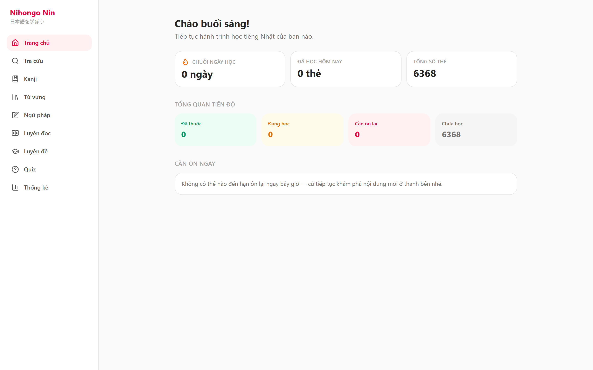
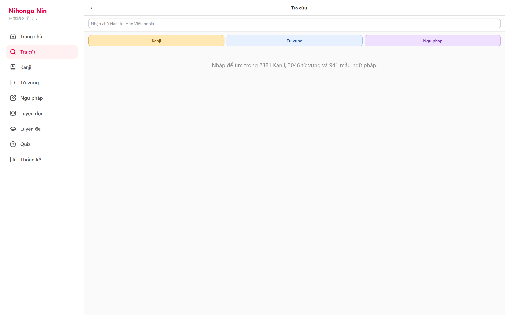
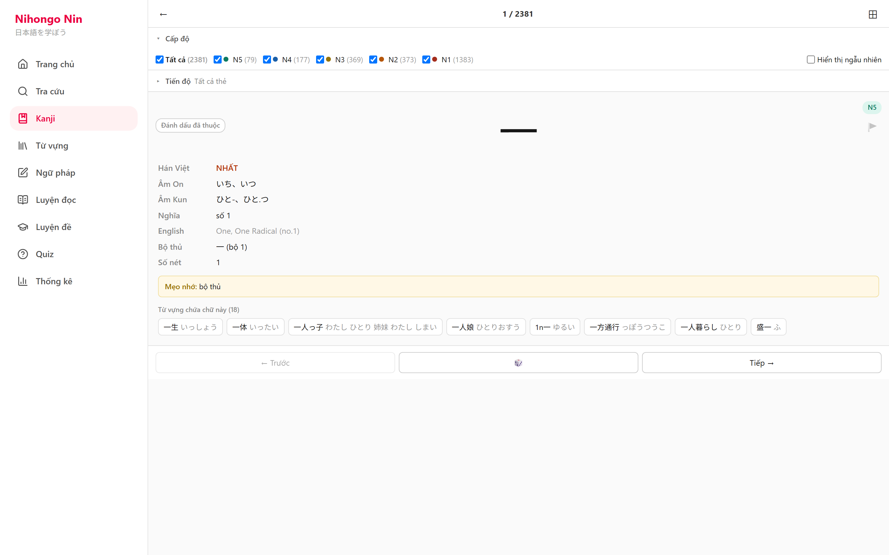
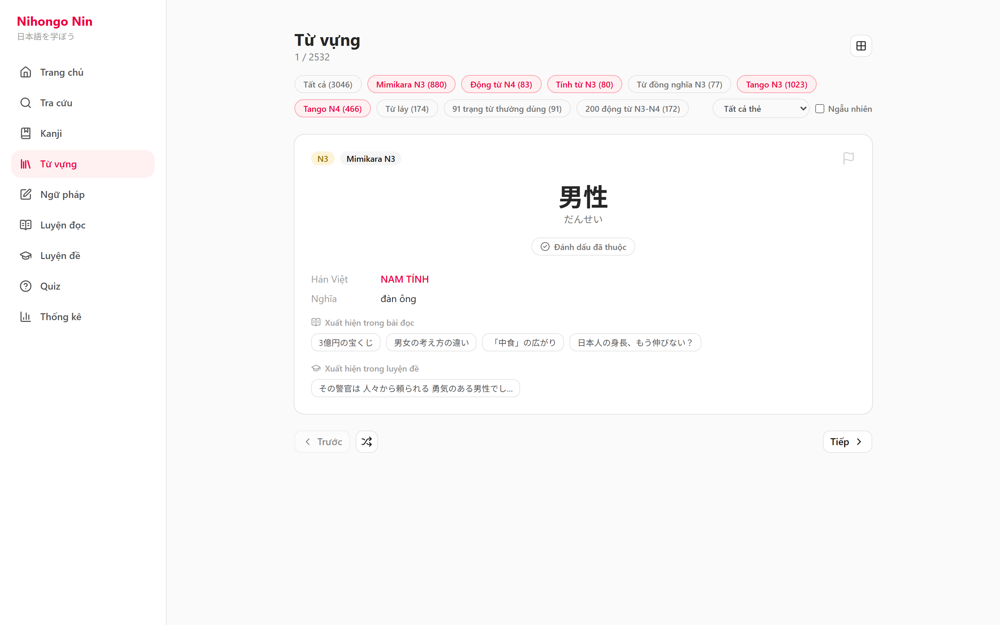
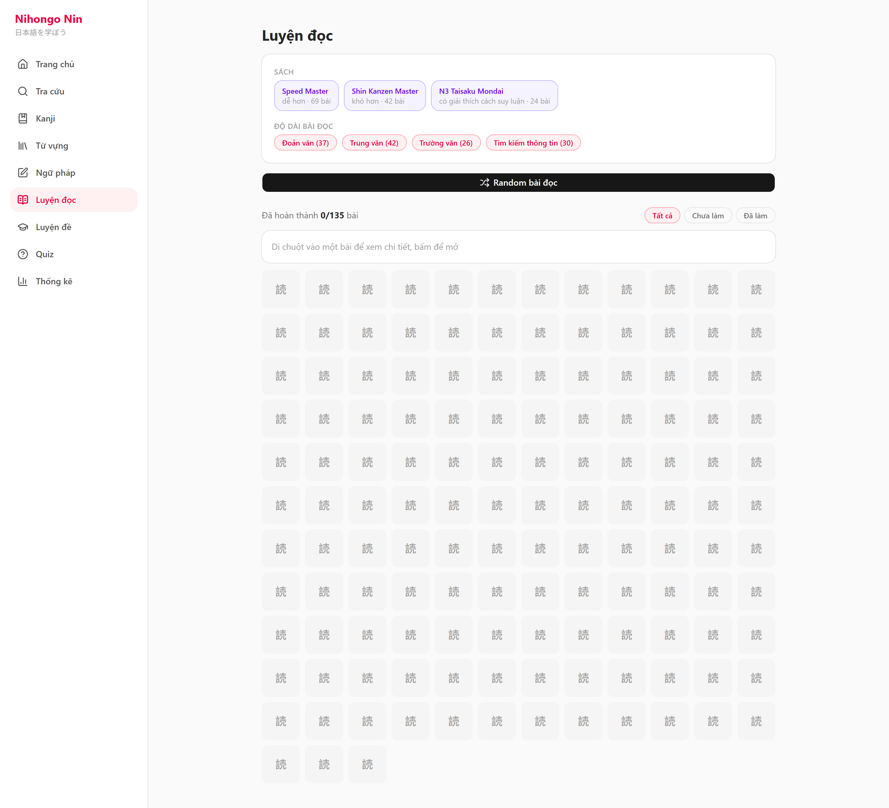
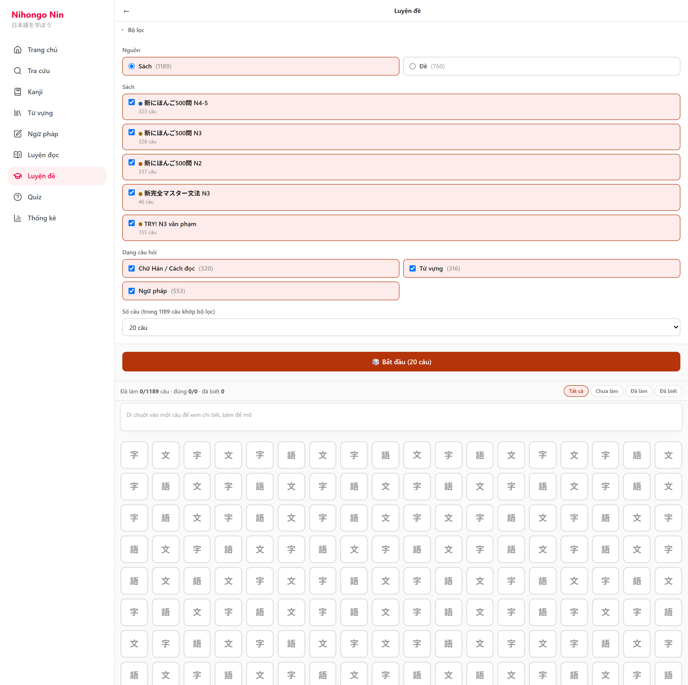
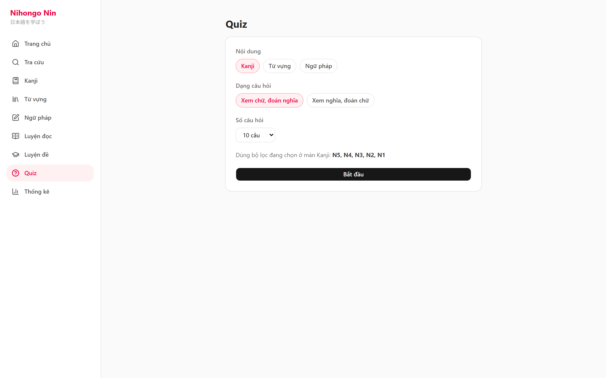

# Chụp màn hình desktop — Nihongo Nin (dist-pages)

Chụp bằng Playwright, viewport 1440×900, branch `feature/web-dashboard-redesign`.
Điều hướng qua sidebar trái. Không có lỗi console trong suốt quá trình chụp (`console/page errors: []`).

Lưu ý: "Tra cứu", "Kanji", "Luyện đề" chưa nằm trong phạm vi redesign (Phase 3 chỉ làm Vocab/Bunpo/Quiz/Reading/Stats/Home) nên vẫn dùng UI cũ của extension, chỉ khác là được bọc trong sidebar shell mới — hoạt động bình thường, chưa đổi giao diện.

## 1. Trang chủ (Home dashboard)

## 2. Tra cứu (Search) — UI cũ

## 3. Kanji — UI cũ

## 4. Từ vựng (Vocab) — đã redesign

## 5. Ngữ pháp (Bunpo) — đã redesign

## 6. Luyện đọc (Reading) — đã redesign

## 7. Luyện đề (QuizBook) — UI cũ

## 8. Quiz — đã redesign

## 9. Thống kê (Stats) — đã redesign

