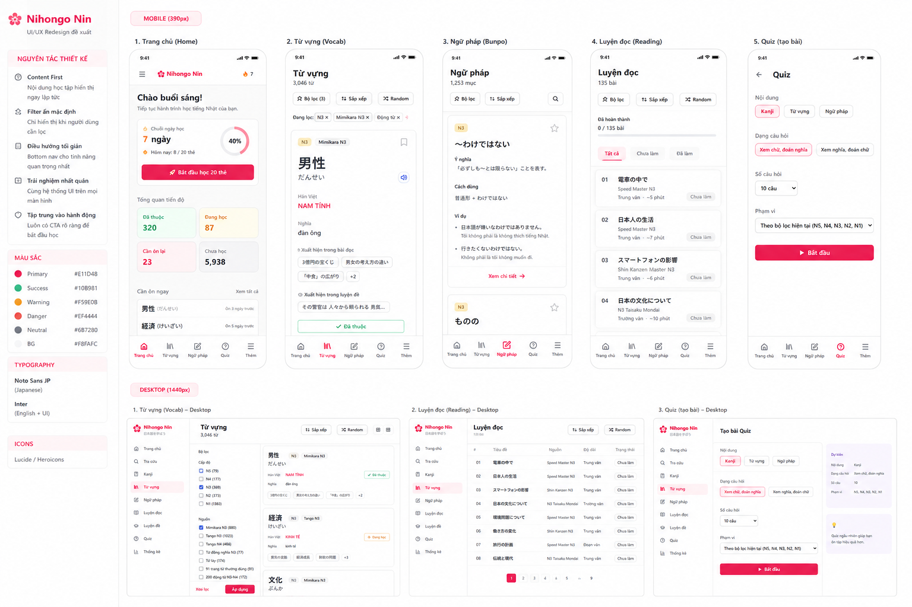

# Nihongo Nin — UI/UX Redesign Specification

> **Mục tiêu:** Cải tiến UI responsive cho Nihongo Nin theo hướng **Content First**, giảm mật độ filter/control trên mobile, đồng bộ pattern giữa mobile và desktop, nhưng **giữ nguyên toàn bộ business logic, data, routing và chức năng hiện tại** nếu không có yêu cầu thay đổi.

## 0. Reference

Mockup trực quan:



**Quan trọng:** Đây là reference về **layout, hierarchy và interaction**, không phải yêu cầu copy pixel-perfect. Ưu tiên UX thực tế, responsive và khả năng maintain code.

---

# 1. Design principles

## 1.1 Content First

Các màn học tập phải đưa nội dung chính lên màn hình càng sớm càng tốt.

### Không nên

```text
Page title
↓
10+ filter chips
↓
sort
↓
random
↓
content
```

### Nên

```text
Page title + count
↓
[ Bộ lọc ] [ Sắp xếp ] [ Action ]
↓
Active filters (nếu có)
↓
CONTENT
```

Filter chỉ mở khi user cần.

---

## 1.2 Progressive disclosure

Không hiển thị toàn bộ options cùng lúc.

- Filter → mở Filter Sheet / Dialog
- Sort → dropdown / popover
- Advanced options → nằm trong filter
- Active filters → hiển thị dạng chip nhỏ
- Random → action riêng, không phải checkbox filter

---

## 1.3 Responsive theo cùng một design system

### Mobile

```text
Header
↓
Page title
↓
Toolbar
↓
Active filters
↓
Content
↓
Bottom navigation
```

### Desktop

```text
Sidebar
+
Main content
    ↓
    Page title
    ↓
    Toolbar
    ↓
    Content
```

Desktop có thể giữ filter sidebar/panel cố định.

Mobile chuyển filter thành bottom sheet hoặc modal.

---

# 2. Global layout

## Mobile

Chiều rộng tham chiếu: ~390px.

```text
┌──────────────────────────────┐
│ ☰  Nihongo Nin               │
├──────────────────────────────┤
│                              │
│ Page title                   │
│ Subtitle / count             │
│                              │
│ [ Bộ lọc ] [ Sắp xếp ] [⋯]  │
│                              │
│ [active filter] [active...]  │
│                              │
│ Main content                 │
│                              │
├──────────────────────────────┤
│ Home Vocab Grammar Quiz More │
└──────────────────────────────┘
```

### Quy tắc

- Không để filter chiếm phần lớn viewport khi chưa mở.
- Page title rõ ràng.
- Khoảng cách giữa các section nhất quán.
- Nội dung học là visual priority cao nhất.
- Bottom navigation cố định.
- Không tạo horizontal overflow ngoài các vùng chip có chủ đích.

---

# 3. Global components nên chuẩn hóa

Nếu codebase đã có component tương đương thì **reuse**, không tạo component duplicate.

## PageHeader

Props/concept:

```text
title
subtitle / count
optional action
```

Ví dụ:

```text
Từ vựng
3,046 từ
```

---

## FilterBar

```text
[ Bộ lọc ] [ Sắp xếp ] [ Random ]
```

### Mobile

Hiển thị compact buttons.

### Desktop

Có thể hiển thị:

```text
[ Sắp xếp ] [ Random ]
```

và filter nằm ở sidebar.

---

## ActiveFilters

Chỉ render khi có filter đang active.

Ví dụ:

```text
Đang lọc:
[N3 ×] [Mimikara N3 ×] [Động từ ×]
```

Nếu quá dài trên mobile:

- horizontal scroll
- không wrap thành quá nhiều dòng.

---

## FilterSheet

Mobile dùng bottom sheet hoặc full-width dialog tùy implementation hiện tại.

Cấu trúc:

```text
Bộ lọc                         ×

Cấp độ
○ N5
○ N4
● N3
○ N2
○ N1

Nguồn
□ Mimikara N3
□ Tango N3
□ Tango N4

Loại từ
□ Danh từ
□ Động từ
□ Tính từ
□ Từ láy

Bộ sưu tập
□ Từ đồng nghĩa N3
□ 200 động từ N3-N4

[ Xóa ]                 [ Áp dụng ]
```

Nếu filter có thể apply realtime thì có thể bỏ nút Apply, nhưng không thay đổi business logic chỉ vì redesign.

---

# 4. Navigation

## Mobile bottom navigation

Giữ 5 item:

```text
Trang chủ
Từ vựng
Ngữ pháp
Quiz
Thêm
```

Không thêm item mới vào bottom navigation.

`Thêm` mở drawer/menu.

---

## Mobile drawer

Nên chia nhóm để giảm cảm giác 9 item ngang hàng.

```text
Nihongo Nin
日本語を学ぼう

🏠 Trang chủ

HỌC
  Kanji
  Từ vựng
  Ngữ pháp
  Luyện đọc

LUYỆN THI
  Luyện đề
  Quiz

CÔNG CỤ
  Tra cứu
  Thống kê
```

Active item dùng primary pink background nhẹ.

Không cần thay đổi route hiện tại.

---

# 5. Từ vựng — Vocabulary

## Current UX problem

Màn hiện tại có quá nhiều chip:

- Tất cả
- Mimikara N3
- Động từ N4
- Tính từ N3
- Từ đồng nghĩa N3
- Tango N3
- Tango N4
- Từ láy
- 91 trang từ thường dùng
- 200 động từ N3-N4
- dropdown
- Random

Các filter này đẩy vocabulary card xuống quá thấp trên mobile.

## New mobile layout

```text
Từ vựng
3,046 từ

[ Bộ lọc ] [ Sắp xếp ] [ Random ]

Đang lọc:
[N3 ×] [Mimikara N3 ×]

────────────────────────

┌─────────────────────────┐
│ N3     Mimikara N3      │
│                         │
│         男性            │
│        だんせい          │
│                         │
│      NAM TÍNH           │
│       đàn ông           │
│                         │
│  Xuất hiện trong bài đọc│
│  [3億円の宝くじ]        │
│  [男女の考え方の違い]   │
│                         │
│       [✓ Đã thuộc]      │
└─────────────────────────┘
```

### Giữ lại

- Kanji
- Furigana
- Hán Việt
- Nghĩa
- Ví dụ / bài đọc liên quan
- Bài luyện đề liên quan
- Trạng thái học
- Previous / Next
- Random

### Thay đổi

Toàn bộ filter collection/category đưa vào Filter Sheet.

---

# 6. Vocabulary Filter mapping

Các filter hiện có phải **không bị mất**.

Gom theo category:

```text
Cấp độ
- N5
- N4
- N3
- N2
- N1

Nguồn
- Mimikara N3
- Tango N3
- Tango N4

Loại từ
- Động từ
- Tính từ
- Danh từ
- Từ láy

Bộ sưu tập
- Từ đồng nghĩa N3
- 91 trang từ thường dùng
- 200 động từ N3-N4
```

**Không hard-code lại data nếu codebase đã có filter configuration/data source.**

---

# 7. Sort

Không dùng:

```text
[Tất cả thẻ ▼] [□ Ngẫu nhiên]
```

Thay bằng:

```text
[ Sắp xếp ▼ ]
```

Options có thể map vào logic hiện tại:

```text
Mặc định
Chưa học
Đang học
Cần ôn
Đã thuộc
Random
```

Nếu codebase hiện tại có các sort khác, giữ nguyên chúng.

---

# 8. Luyện đọc — Reading

## Current UX problem

Sách + độ dài + random + trạng thái + 135 item đang chiếm nhiều diện tích.

## New mobile layout

```text
Luyện đọc
135 bài

[ Bộ lọc ] [ Sắp xếp ] [ Random ]

Đã hoàn thành
0 / 135

[Tất cả] [Chưa làm] [Đã làm]

────────────────────────

01
電車の中で
Speed Master N3
Trung văn · ~5 phút
Chưa làm

────────────────────────

02
日本人の生活
Speed Master N3
Trung văn · ~7 phút
Chưa làm
```

### Mobile

**Không dùng grid chỉ hiển thị `読` như placeholder chính.**

Dùng list/card có thông tin đủ để user nhận diện bài.

### Desktop

Có thể dùng table/list:

```text
# | Tiêu đề | Nguồn | Độ dài | Trạng thái
01 | 電車の中で | Speed Master N3 | Trung văn | Chưa làm
02 | 日本人の生活 | Speed Master N3 | Trung văn | Chưa làm
```

---

# 9. Reading filters

Gom vào Filter Sheet:

```text
Nguồn sách
○ Tất cả
○ Speed Master
○ Shin Kanzen Master
○ N3 Taisaku Mondai

Độ dài
○ Tất cả
○ Đoạn văn
○ Trung văn
○ Trường văn
○ Tìm kiếm thông tin

Trạng thái
○ Tất cả
○ Chưa làm
○ Đã làm
```

Không xóa bất kỳ category/filter hiện tại nào.

---

# 10. Ngữ pháp — Grammar

Áp dụng cùng pattern.

```text
Ngữ pháp
1,253 mục

[ Bộ lọc ] [ Sắp xếp ] [ Tìm kiếm ]

Đang lọc:
[N3 ×]

────────────────────────

N3

～わけではない

Ý nghĩa
Không hẳn là...

Cách dùng
普通形 + わけではない

Ví dụ
...
```

Grammar card nên ưu tiên:

1. Pattern
2. Ý nghĩa
3. Cách dùng
4. Ví dụ
5. Related grammar
6. Trạng thái học

---

# 11. Kanji

Áp dụng:

```text
Kanji
N3 · 370 chữ

[ Bộ lọc ] [ Sắp xếp ] [ Random ]

────────────────────────

男

オン: ダン・ナン
くん: おとこ

男性
男の子
男女

[ Chưa học ]
```

Quiz có thể tiếp tục dùng filter Kanji hiện tại.

---

# 12. Quiz

Màn Quiz hiện tại tương đối ổn.

Giữ concept:

```text
Quiz

Nội dung
[ Kanji ] [ Từ vựng ] [ Ngữ pháp ]

Dạng câu hỏi
[ Xem chữ, đoán nghĩa ]
[ Xem nghĩa, đoán chữ ]

Số câu hỏi
[ 10 câu ▼ ]

Phạm vi
[ Theo bộ lọc hiện tại ▼ ]

[ Bắt đầu ]
```

### UX improvement

Thay câu:

> Dùng bộ lọc đang chọn ở màn Kanji...

bằng một control rõ ràng:

```text
Phạm vi
[ Theo bộ lọc hiện tại ▼ ]
```

Nếu có các scope khác trong codebase thì đưa vào dropdown.

---

# 13. Home

Home hiện tại có hierarchy tốt:

```text
Chào buổi sáng
↓
Streak / hôm nay
↓
Tổng số thẻ
↓
Tiến độ
↓
Cần ôn ngay
```

Nên bổ sung CTA rõ hơn.

Ví dụ khi không có card cần ôn:

```text
Cần ôn ngay

Không có thẻ đến hạn ôn.

[ Học 10 từ mới → ]
```

CTA phải dẫn đến flow học hiện có, **không tạo flow mới nếu codebase chưa có**.

---

# 14. Desktop layout

Desktop nên dùng sidebar + main content.

## Vocabulary

```text
┌──────────────┬──────────────────────────────────┐
│ Sidebar      │ Từ vựng                          │
│              │ 3,046 từ                         │
│ Navigation   │                                  │
│              │ [Sắp xếp] [Random]               │
│              │                                  │
│ Bộ lọc       │ ┌──────────────────────────────┐ │
│              │ │ 男性                         │ │
│ Cấp độ       │ │ だんせい                     │ │
│ □ N5         │ │ NAM TÍNH                     │ │
│ □ N4         │ │ đàn ông                      │ │
│ ☑ N3         │ │                              │ │
│ □ N2         │ │ [✓ Đã thuộc]                 │ │
│ □ N1         │ └──────────────────────────────┘ │
│              │                                  │
│ Nguồn        │ ...                              │
│ ☑ Mimikara   │                                  │
│ □ Tango      │                                  │
└──────────────┴──────────────────────────────────┘
```

Desktop filter có thể persistent.

Mobile filter chuyển thành modal/sheet.

---

# 15. Desktop Reading

```text
┌──────────────┬──────────────────────────────────┐
│ Sidebar      │ Luyện đọc                        │
│              │ 135 bài                          │
│ Navigation   │                                  │
│              │ [Sắp xếp] [Random]               │
│              │                                  │
│              │ Đã hoàn thành 0 / 135            │
│              │                                  │
│              │ # | Tiêu đề | Nguồn | Độ dài    │
│              │ 01| 電車の中で | Speed | Trung   │
│              │ 02| 日本人... | Speed | Trung   │
└──────────────┴──────────────────────────────────┘
```

---

# 16. Visual design

Giữ tinh thần visual hiện tại của Nihongo Nin.

## Primary

Pink/red accent hiện tại của app.

Không đổi brand color chỉ vì redesign.

## Status colors

Có thể giữ semantic:

```text
Success → xanh
Warning → cam
Need review → đỏ/pink
Neutral → xám
```

Không lạm dụng màu.

Màu chỉ dùng để truyền tải:

- active
- status
- CTA
- feedback

---

# 17. Typography

Ưu tiên font hỗ trợ tốt tiếng Việt + Nhật.

Nếu project đã có font system thì reuse.

Hierarchy:

```text
Page title       28–32px / bold
Section title    20–24px / semibold
Card title       18–22px / semibold
Body             15–17px
Secondary        13–15px
```

Kanji chính có thể lớn hơn:

```text
48–64px
```

Không làm text quá nhỏ chỉ để fit nhiều data.

---

# 18. Spacing

Dùng spacing scale thống nhất.

Ví dụ:

```text
4
8
12
16
20
24
32
```

Các card:

- border radius khoảng 16–20px
- border nhẹ
- shadow rất nhẹ hoặc không shadow
- padding mobile khoảng 16–20px

Không biến mọi element thành card có shadow.

---

# 19. Interaction rules

## Filter

```text
User chưa filter
→ chỉ thấy [Bộ lọc]

User chọn filter
→ hiển thị ActiveFilters

User mở filter
→ các lựa chọn hiện tại phải được giữ nguyên

User Apply
→ update list

User Clear
→ reset về trạng thái mặc định
```

## Navigation

Active navigation phải rõ.

Không thay đổi URL/routing hiện tại nếu không cần thiết.

## Back

Mobile sheet/modal:

```text
Open → close
```

không được phá browser navigation.

---

# 20. Responsive breakpoints

Không chỉ target 390px.

Kiểm tra ít nhất:

```text
360px
375px
390px
414px
768px
1024px
1280px
1440px+
```

### Đặc biệt

Ở 360px:

- toolbar không overflow
- chip không phá layout
- bottom nav không đè content
- card không bị horizontal scroll
- Japanese text không bị cắt bất thường

---

# 21. Accessibility

Cần đảm bảo:

- Button có label rõ.
- Icon-only button có aria-label.
- Focus state.
- Keyboard navigation desktop.
- Modal/sheet có focus management.
- Contrast đủ cao.
- Không dùng màu là tín hiệu duy nhất cho status.

Ví dụ:

```text
Random
```

không chỉ dùng icon.

---

# 22. Implementation strategy cho Claude Code

## Phase 1 — Audit

Trước khi sửa:

1. Tìm cấu trúc routing.
2. Tìm layout/global navigation.
3. Tìm component filter hiện tại.
4. Tìm vocabulary page.
5. Tìm grammar page.
6. Tìm kanji page.
7. Tìm reading page.
8. Tìm quiz page.
9. Xác định shared components.
10. Xác định data/state/filter logic hiện tại.

**Không rewrite architecture nếu không cần thiết.**

---

## Phase 2 — Create shared UI primitives

Ưu tiên reuse/create:

```text
PageHeader
FilterBar
ActiveFilters
FilterSheet
SortDropdown
ContentCard
StatusBadge
EmptyState
```

Chỉ tạo component mới nếu chưa có component tương đương.

---

## Phase 3 — Refactor Vocabulary

Làm trước vì đây là màn có vấn đề UX rõ nhất.

Acceptance criteria:

- Mobile không còn hàng loạt filter chip phía trên content.
- Content xuất hiện trong viewport sớm hơn.
- Tất cả filter cũ vẫn hoạt động.
- Active filters vẫn hiển thị.
- Sort vẫn hoạt động.
- Random vẫn hoạt động.
- Previous/Next vẫn hoạt động.
- Learning status không thay đổi.

---

## Phase 4 — Refactor Reading

Acceptance criteria:

- Filter sách/độ dài/trạng thái nằm trong Filter Sheet trên mobile.
- Reading list có title/source/type/status.
- Không dùng grid `読` làm UI chính trên mobile.
- Desktop có table/list phù hợp.
- Progress vẫn chính xác.

---

## Phase 5 — Grammar + Kanji

Áp dụng shared layout.

Không tạo UX hoàn toàn khác cho từng module.

---

## Phase 6 — Navigation

Refactor drawer thành:

```text
HỌC
LUYỆN THI
CÔNG CỤ
```

Không thay đổi route.

---

## Phase 7 — QA

Test:

### Mobile

- 360px
- 390px
- 414px

### Desktop

- 1280px
- 1440px
- 1920px

### Functional

- Filter
- Clear filter
- Sort
- Random
- Search
- Pagination
- Previous/Next
- Mark learned
- Review status
- Navigation
- Quiz generation

---

# 23. Những điều KHÔNG được làm

Claude Code **không được tự ý**:

- Xóa filter hiện tại.
- Xóa data.
- Đổi schema database.
- Đổi API contract.
- Đổi route chỉ vì redesign.
- Thay đổi logic SRS/review.
- Thay đổi cách tính progress.
- Thay đổi quiz scoring.
- Xóa chức năng chỉ vì mobile không đủ chỗ.
- Hard-code data mới thay cho data hiện tại.
- Rewrite toàn bộ project khi chỉ cần refactor UI.
- Thêm dependency lớn nếu không cần thiết.

---

# 24. Definition of Done

UI redesign được xem là hoàn thành khi:

- [ ] Mobile content-first.
- [ ] Filter được collapse.
- [ ] Filter Sheet hoạt động.
- [ ] Active filters hiển thị rõ.
- [ ] Sort/Random gọn.
- [ ] Reading mobile chuyển sang list.
- [ ] Desktop có sidebar/filter phù hợp.
- [ ] Navigation được group.
- [ ] UI giữa Vocabulary/Kanji/Grammar/Reading đồng nhất.
- [ ] Không mất business logic.
- [ ] Không mất data.
- [ ] Không có horizontal overflow.
- [ ] Không phá routing.
- [ ] Không regression các chức năng học tập.

---

# 25. Prompt ngắn để giao Claude Code

Bạn có thể gửi file này cho Claude Code và dùng instruction:

> Đọc toàn bộ `nihongo-nin-ui-redesign.md` trước khi chỉnh sửa.
>
> Hãy audit codebase hiện tại và đối chiếu với specification.
>
> **Không code ngay.** Trước tiên hãy:
>
> 1. Xác định các page/component liên quan.
> 2. Xác định filter/state/business logic hiện tại.
> 3. Xác định component nào có thể reuse.
> 4. Đề xuất implementation plan theo từng phase.
> 5. Nêu rõ file nào sẽ thay đổi.
>
> Sau khi audit, implement theo thứ tự:
>
> **Vocabulary → Reading → Grammar → Kanji → Navigation → QA responsive.**
>
> Ưu tiên:
>
> **Content First + Progressive Disclosure + Responsive consistency.**
>
> Không rewrite architecture và không thay đổi business logic nếu không cần thiết.
>
> Sau mỗi phase, kiểm tra regression trước khi chuyển phase tiếp theo.

---

# 26. Priority

### P0 — bắt buộc

- Content-first
- Collapse filters
- Mobile Filter Sheet
- Vocabulary redesign
- Reading redesign
- Responsive toolbar

### P1

- Shared components
- Navigation grouping
- Grammar/Kanji đồng bộ
- Desktop sidebar

### P2

- Typography refinement
- Micro interaction
- Animation
- Accessibility refinement

---

## Final direction

Nihongo Nin nên chuyển từ:

**"Ứng dụng hiển thị rất nhiều dữ liệu và filter"**

sang:

**"Ứng dụng học tập tập trung vào một nội dung tại một thời điểm."**

Filter vẫn phải mạnh vì app có rất nhiều dataset, nhưng **filter không được cạnh tranh với nội dung học**.

> **Default state = simple.  
> Advanced state = powerful.**
